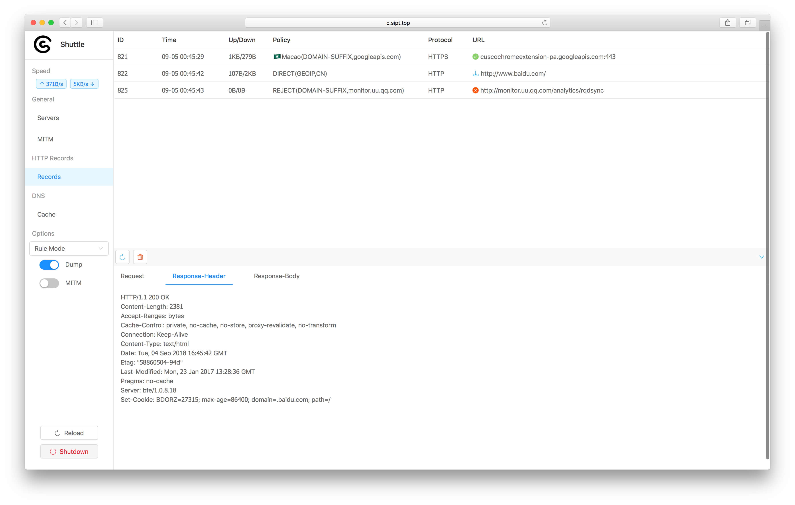
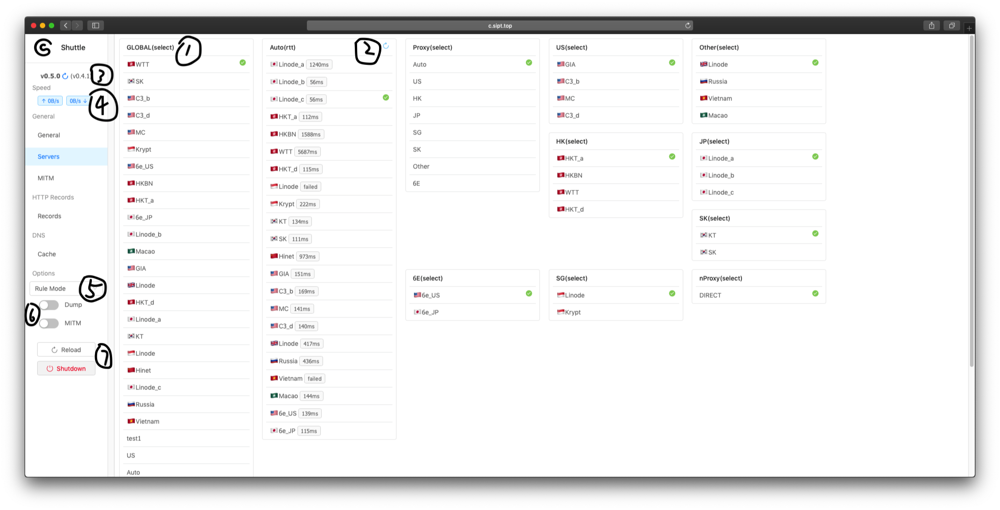

# Shuttle

**Shuttle**是一个基于Go开发的**全平台**网络代理工具。（logo**@不二**）


- [介绍](#介绍)
- [功能](#功能)
- [安装与启动](#安装与启动)
  - [MacOS](#macos)
  - [Windows](#windows)
  - [Linux](#linux)
- [配置](#配置)
  - [版本](#版本)
  - [常规配置](#常规配置)
  - [代理服务器配置](#代理服务器配置)
  - [DNS配置](#dns配置)
  - [请求/返回修改及反向代理](#请求/返回修改及反向代理)
  - [MitM](#mitm)
  - [规则配置](#规则配置)
- [Web控制台](#Web控制台)
  - [Servers](#servers)
  - [DNS Cache](#dns-cache)
  - [Records](#records)
  - [抓包教程](#抓包教程)

## 介绍

Shuttle 是基于Go实现的全平台网络代理：

* 支持`SOCKS5`、`SOCKS5 over TLS`、`shadowsocks`协议
* 支持规则代理：域名、IP段、GEO-IP
* 支持代理方式：直连、拒绝、代理
* 多代理服务器选择，支持分组管理。组中服务器选择方式：往返时间选择(rtt)和手动选择(select)
* 支持HTTP/HTTPS 抓包，反向代理、请求头修改、返回头修改、返回值伪造等
* 支持DNS解析方式：静态解析(static)、直连解析(direct)、代理服务器解析(remote)

结构模块：


截图示例：



## 功能
- [ ] 代理功能
  - [x] TCP(HTTP/HTTPS)
  - [ ] UDP
- [x] 扩展功能
  - [x] HTTP抓包
  - [x] HTTPS抓包(MITM)
  - [x] 反向代理
  - [x] 复用连接内请求切分
  - [x] 请求头修改
  - [x] 返回头修改
  - [x] 请求mapping
- [x] 远端多服务器管理
  - [x] 服务器分组包含
  - [x] 服务器协议支持
    - [x] shadowsocks
    - [x] SOCKS5
    - [x] SOCKS5 over TLS
  - [x] 服务器选择
    - [x] RTT(往返时间)选择
    - [x] Select(手动)选择
- [x] 代理模式
  - [x] 全局代理
  - [x] 全局直连
  - [x] 全局拒绝
  - [x] 规则代理
    - [x] DOMAIN：域名全匹配
    - [x] DOMAIN-SUFFIX：域名后缀匹配
    - [x] DOMAIN-KEYWORD：域名关键字匹配
    - [x] IP-CIDR：ip段匹配
    - [x] GEO-IP: 支持GEO-IP路由
    - [ ] ~~USER-AGENT：HTTP头字匹配~~
- [x] DNS
  - [x] static：静态地址映射
  - [x] direct：直连DNS解析
  - [x] remote：远程服务器DNS解析(防止DNS污染)
  - [x] GEO-IP判断
- [x] 外部窗口
  - [x] API
  	- [x]  获取服务器列表
  	- [x]  RTT分组刷新
  	- [x]  Select分组手动选择
  	- [x]  DNS缓存获取
  	- [x]  DNS缓存刷新
  	- [x]  请求记录列表获取
  	- [x]  请求记录清空
  	- [x]  CA证书生成
  	- [x]  CA证书下载
  	- [x]  HTTP Dump开关
  	- [x]  MITM 开关
  	- [x]  HTTP/HTTPS抓包内容获取 
  	- [x]  关闭Shuttle
  	- [x]  重载配置
  	- [x]  全局代理开关
  	- [ ]  支持Websocket，完成内容增量更新
  - [x] Web UI
  	- [x] Web UI (angular6 + ant design)
- [ ] 优化
  - [ ] 内存优化
  - [ ] log日志


## 安装与启动

### MacOS

#### 准备

下载release文件并解压，完成后目录结构：

```
shuttle
   ├── GeoLite2-Country.mmdb
   ├── RespFiles/ #mock文件存方
   ├── shuttle  #shuttle主程序
   ├── shuttle.yaml #配置文件
   ├── start.sh #启动脚本
   └── view/ #web界面目录

```

打开配置文件：`shuttle.yaml`，启动前要注意的是端口号冲突，配置文件中预设的是：`8080`,`8081`,`8082`

```yaml
General:
  http-port: "8080"  #http/https 代理端口
  socks-port: "8081" #socks 代理端口
  controller-port: "8082" #控制台服务端口
```

#### 启动

在命令行中进入该目录，运行

```shell
./start.sh #不会有任何输出
```

此时不会有任何输出，此时在浏览器中打开`http://localhost:8082`（以`controller-port: "8082"`为例），如果能打开控制台页面就说明启动成功，如果打开失败可以查看`shuttle.log`查看原因，如果排查不出原因可以去提`Issues`。

#### 系统配置

打开系统偏好设置 => 网络 => 高级 => 代理，这里主要设置三个：

* `Web 代理（HTTP）` 设置为`127.0.0.1:8080`（以`http-port: "8080"`为例）
* `Web 代理（HTTPS）`  设置为`127.0.0.1:8080`（以`http-port: "8080"`为例）
* `SOCKS 代理`  设置为`127.0.0.1:8080`（以`socks-port: "8081"`为例）

然后点击OK，再点击应用，此时用浏览器打开`http://c.sipt.top`这时如果已经设置代理成功这个url也是对应到控制台页面。

命令行走代理：

```shell
export https_proxy="http://127.0.0.1:8080"
export http_proxy="http://127.0.0.1:8080"
export all_proxy="socks5://127.0.0.1:8081"
```

### Windows

#### 准备

下载release文件并解压，完成后目录结构：

```
shuttle
   ├── GeoLite2-Country.mmdb
   ├── RespFiles/ #mock文件存方
   ├── shuttle  #shuttle主程序
   ├── shuttle.yaml #配置文件
   ├── startup.bat #启动
   └── view/ #web界面目录

```

打开配置文件：`shuttle.yaml`，启动前要注意的是端口号冲突，配置文件中预设的是：`8080`,`8081`,`8082`

```yaml
General:
  http-port: "8080"  #http/https 代理端口
  socks-port: "8081" #socks 代理端口
  controller-port: "8082" #控制台服务端口
```

#### 启动

双击打开`startup.bat`，此时不会有任何输出，此时在浏览器中打开`http://localhost:8082`（以`controller-port: "8082"`为例），如果能打开控制台页面就说明启动成功，如果打开失败可以查看`shuttle.log`查看原因，如果排查不出原因可以去提`Issues`。

#### 系统配置

打开系统偏好设置 => 网络 => 代理：设置为`127.0.0.1:8080`（以`http-port: "8080"`为例）

此时用浏览器打开`http://c.sipt.top`这时如果已经设置代理成功这个url也是对应到控制台页面。

### Linux

#### 准备

下载release文件并解压，完成后目录结构：

```
shuttle
   ├── GeoLite2-Country.mmdb
   ├── RespFiles/ #mock文件存方
   ├── shuttle  #shuttle主程序
   ├── shuttle.yaml #配置文件
   ├── start.sh #启动脚本
   └── view/ #web界面目录

```

打开配置文件：`shuttle.yaml`，启动前要注意的是端口号冲突，配置文件中预设的是：`8080`,`8081`,`8082`

```yaml
General:
  http-port: "8080"  #http/https 代理端口
  socks-port: "8081" #socks 代理端口
  controller-port: "8082" #控制台服务端口
```

#### 启动

在命令行中进入该目录，运行

```shell
./start.sh #不会有任何输出
```

此时不会有任何输出，此时在浏览器中打开`http://localhost:8082`（以`controller-port: "8082"`为例），如果能打开控制台页面就说明启动成功，如果打开失败可以查看`shuttle.log`查看原因，如果排查不出原因可以去提`Issues`。


## 配置

### 版本

```yaml
ver: v1.0.1
```

当前配置文件版本只支持`v1.0.1`，不可修改

### 常规配置

```yaml
General:
  loglevel: "info"
  dns-server:
  - "114.114.114.114"
  - "223.5.5.5"
  http-port: "8080"
  http-interface: "0.0.0.0"
  socks-port: "8081"
  socks-interface: "0.0.0.0"
  controller-port: "8082"
  controller-interface: "0.0.0.0"
```

| 名称                 | 描述                           | 值                     |
| -------------------- | ------------------------------ | ---------------------- |
| loglevel             | 打印log的等级，建议info或error | trace,debug,info,error |
| dns-server           | DNS服务器地址                  | IP地址数组             |
| http-port            | HTTP/HTTPS 代理端口            |                        |
| http-interface       | HTTP/HTTPS 代理访问控制        |                        |
| socks-port           | SOCKS 代理端口                 |                        |
| socks-interface      | SOCKS 代理访问控制             |                        |
| controller-port      | 控制器服务端口                 |                        |
| controller-interface | 控制器服务访问控制             |                        |


### 代理服务器配置

服务器名与服务器分组名相互都不能有重复，包括保留名：**DIRECT**, **REJECT**, **GLOBAL**

#### 服务器

```yaml
Proxy:
  "🇯🇵JP_a": ["ss", "jp.a.example.com", "12345", "rc4-md5", "123456"]
  "🇯🇵JP_b": ["ss", "jp.b.example.com", "12345", "rc4-md5", "123456"]
  "🇯🇵JP_c": ["ss", "jp.c.example.com", "12345", "rc4-md5", "123456"]
  "🇭🇰HK_a": ["ss", "hk.a.example.com", "12345", "rc4-md5", "123456"]
  "🇭🇰HK_b": ["ss", "hk.b.example.com", "12345", "rc4-md5", "123456"]
  "🇭🇰HK_c": ["ss", "hk.c.example.com", "12345", "rc4-md5", "123456"]
  "🇺🇸US_a": ["ss", "us.a.example.com", "12345", "rc4-md5", "123456"]
  "🇺🇸US_b": ["ss", "us.b.example.com", "12345", "rc4-md5", "123456"]
  "🇺🇸US_c": ["ss", "hk.c.example.com", "12345", "rc4-md5", "123456"]
  "socks": ["socks", "localhost", "12345"]
  "socks-tls": ["socks-tls", "localhost", "12345", "skip-verify"]
  "socks-auth": ["socks", "localhost", "12345", "user", "password"]
  "socks-tls-auth": ["socks-tls", "localhost", "12345", "skip-verify", "user", "password"]
  ...
```

服务器协议:

* ss: shadowsocks; 

  配置格式：

  ```yaml
  "服务器名": ["ss", "服务器地址(域名/IP)", "端口号", "加密方式", "密码"]
  ```

  目前支持加密方式：

  * [x] aes-128-cfb
  * [x] aes-192-cfb
  * [x] aes-256-cfb
  * [x] aes-128-ctr
  * [x] aes-192-ctr
  * [x] aes-256-ctr
  * [x] des-cfb
  * [x] bf-cfb
  * [x] cast5-cfb
  * [x] rc4-md5
  * [x] chacha20
  * [x] chacha20-ietf
  * [x] salsa20
  * [x] aes-256-gcm
  * [x] aes-192-gcm
  * [x] aes-128-gcm
  * [x] chacha20-ietf-poly1305

* socks: SOCKS5;

  支持用户名/密码认证。

  配置格式：

  ```yaml
  "服务器名": ["socks", "服务器地址(域名/IP)", "端口号"] 
  "服务器名": ["socks", "服务器地址(域名/IP)", "端口号", "用户名", "密码"]
  ```

* socks-tls: SOCKS5 over TLS;

  支持用户名/密码认证。对于服务器的证书可以配置是否验证：`skip-verify`或`verify`
  配置格式：

  ```yaml
  "服务器名": ["socks-tls", "服务器地址(域名/IP)", "是否验证证书", "端口号"] 
  "服务器名": ["socks-tls", "服务器地址(域名/IP)", "是否验证证书", "端口号", "用户名", "密码"]
  ```


#### 服务器组

```yaml
Proxy-Group:
  "Auto": ["rtt", "🇭🇰HK_a", "🇭🇰HK_b", "🇭🇰HK_c", "🇯🇵JP_a", "🇯🇵JP_b", "🇯🇵JP_c", "🇺🇸US_a", "🇺🇸US_b", "🇺🇸US_c"]
  "HK": ["select", "🇭🇰HK_a", "🇭🇰HK_b", "🇭🇰HK_c"]
  "JP": ["select", "🇯🇵JP_a", "🇯🇵JP_b", "🇯🇵JP_c"]
  "US": ["select", "🇺🇸US_a", "🇺🇸US_b", "🇺🇸US_c"]
  "Proxy": ["select", "Auto", "HK", "JP", "US"]
  "nProxy": ["select", "DIRECT"]
```

配置格式：

```yaml
"分组名": ["选择方式", "服务器名/服务器分组名", ... ]
```

| 选择方式 | 描述                                                |
| -------- | --------------------------------------------------- |
| select   | 手动选择                                            |
| rtt      | 本机穿过远端到达`www.gstatic.com`的往返时间评出最优 |


### DNS配置

```yaml
Local-DNS:
- ["DOMAIN", "localhost", "static", "127.0.0.1"]
- ["DOMAIN-KEYWORD", "google", "remote", ""]
- ["DOMAIN-SUFFIX", "baidu.com", "direct", "114.114.114.114"]
```

配置格式：

```yaml
- ["匹配方式", "值", "解析方式", "参数"]
```

| 匹配方式       | 描述           | 值       |
| -------------- | -------------- | -------- |
| DOMAIN-SUFFIX  | 域名后缀匹配   | 域名后缀 |
| DOMAIN         | 域名全匹配     | 域名     |
| DOMAIN-KEYWORD | 域名关键字匹配 | 关键字   |

| 解析方式 | 描述              | 参数          |
| -------- | ----------------- | ------------- |
| static   | 静态解析          | 对应的IP地址  |
| direct   | 直连DNS服务器解析 | DNS服务器地址 |
| remote   | 让远端服务器解析  | 无            |


### 请求/返回修改及反向代理

**HTTPS必须开始MitM才生效**

```yaml
Http-Map:
  Req-Map: #配置请求的修改
    - url-rex: "^http://www.zhihu.com"
      type: "UPDATE"
      items:
        - ["HEADER", "Scheme", "http"]
  Resp-Map: #配置返回值的修改
      - url-rex: "^http://www.zhihu.com"
      type: "UPDATE"
      items:
         - ["STATUS", "", "301"]
         - ["HEADER", "Location", "http://www.jianshu.com"]
```

| 名称    | 描述                                                         |
| ------- | ------------------------------------------------------------ |
| url-rex | 正则表达式用来匹配请求的URL                                  |
| type    | `UPDATE`（修改）和`MOCK`(本地数据返回)，(`Resp-Map`只支持`UPDATE`) |
| items   | 是一个`["修改类型", "Key", "Value"]`的数组(详见另表)         |

| 修改类型 | 描述                                                         | 使用条件                                        |
| -------- | ------------------------------------------------------------ | ----------------------------------------------- |
| HEADER   | 添加/修改头信息([示例](#请求头修改))                         | (`Req-Map`or`Resp-Map`) type:(`UPDATE`or`MOCK`) |
| STATUS   | 修改返回状态码([示例](#请求回本地数据))                      | (`Resp-Map`) type:(`UPDATE`or`MOCK`)            |
| BODY     | Response Body([示例](#请求回本地数据))<br />(HTTPS链接域名必须存在并支持HTTPS) | (`Resp-Map`) type:(`MOCK`)                      |
| URL      | 把`url-rex`替换成`URL`，<br />**暂时不支持HTTPS** ([反向代理](#反向代理)) | (`Req-Map`) type:(`UPDATE`)                     |

#### 例：

##### 请求头修改

把符合`^http://www.zhihu.com`的请求，都添加一个请求头`Scheme: http`

```yaml
Http-Map:
  Req-Map:
      - url-rex: "^http://www.zhihu.com"
      type: "UPDATE"
      items:
        - ["HEADER", "Scheme", "http"]
```


##### 请求回本地数据

**type是MOCK时：HTTP链接域名随意；HTTPS链接域名必须存在并支持HTTPS**

把符合`^http://www.baidu.com/$`的请求，都直接返回数据：

```json
{
  "name": "Shuttle",
  "github-link": "https://github.com/sipt/shuttle",
  "data": "response mock"
}
```

在安装目录的`RespFiles`目录下面创建一个文件`mocks.json`写入数据以上数据。

配置：

```yaml
Http-Map:
  Req-Map:
    - url-rex: "^http://www.wogaoxing.abcascb" #HTTP时，链接域名随意
      type: "MOCK"
      items:
        - ["STATUS", "", "200"] #返回状态码：200 OK
        - ["HEADER", "Content-Type", "application/json"] #添回返回头
        - ["BODY", "", "mock.json"] #返回数据对应RespFiles下mock.json文件
    - url-rex: "^https://www.baidu.com" #HTTPS时，链接域名必须存在并支持HTTPS
      type: "MOCK"
      items:
        - ["STATUS", "", "200"] #返回状态码：200 OK
        - ["HEADER", "Content-Type", "application/json"] #添回返回头
        - ["BODY", "", "mock.json"] #返回数据对应RespFiles下mock.json文件
```


##### 反向代理

**暂时不支持HTTPS**

把符合`^http://www.baidu.com`的请求，都反向代理到`http://www.zhihu.com`：

```yaml
Http-Map:
  Req-Map:
    - url-rex: "^http://www.baidu.com"
      type: "UPDATE"
      items:
       - ["URL", "", "http://www.zhihu.com"]
```


### MitM

```yaml
MITM: 
  rules: ["*.baidu.com", "*.zhihu.com"] #允许MitM的域名
  ca: (base64) # CA证书和私钥，不需要配置，由程序自动生成，保存在这里
  key: (base64)
```


### 规则配置

```yaml
Rule: # 代理规则
- ["DOMAIN-SUFFIX", "gitlab.anjian.com", "DIRECT", ""]
# - [域名全匹配，域名，走分组Proxy，]
- ["DOMAIN", "sipt.top", "Proxy", ""]
# - [域名关键字匹配，关键字，拒绝连接，]
- ["DOMAIN-KEYWORD", "zjtoolbar", "REJECT", ""]
# - [IP网段断匹配，IP网段，直连，]
- ["IP-CIDR", "127.0.0.0/8", "DIRECT", ""]
# - [GEOIP匹配，中国，走nProxy组规则，]
- ["GEOIP", "CN", "nProxy", ""]
# - [以上都不满足，，走Proxy组规则，]
- ["FINAL", "", "Proxy", ""]
```

格式：

```yaml
- ["匹配方式"，"值"，"连接方式"，"备注"]
```

| 匹配方式       | 描述           | 值       |
| -------------- | -------------- | -------- |
| DOMAIN-SUFFIX  | 域名后缀匹配   | 域名后缀 |
| DOMAIN         | 域名全匹配     | 域名     |
| DOMAIN-KEYWORD | 域名关键字匹配 | 关键字   |
| IP-CIDR        | IP网段断匹配   | IP网段   |
| GEOIP          | GEOIP匹配      | 国家编码 |
| FINAL          | 以上都不满足   | [无]     |

| 连接方式           | 描述               |
| ------------------ | ------------------ |
| DIRECT             | 直接连接目标服务器 |
| REJECT             | 拒绝连接           |
| 配置的服务器名     |                    |
| 配置的服务器分组名 |                    |


## Web控制台

http://c.sipt.top

### Servers



图中加了标注，可放大查看说明

### DNS Cache


查看当前系统的入网所有域名的DNS解析
左下角提供刷新和清空按钮，目前还只支持全量刷新

### Records


查看当前系统的入网所有请求，匹配了哪条规则等
当前只会保留1000条数据，

### 抓包教程

HTTP抓包只需打开Dump，Records列表中显示为 下载 图标的就是已经Dump数据的记录，可以直接点击查看。

HTTPS抓包需要几个步骤：


1. 生成证书：Generate生成证书，每次点击都会生成新的CA证书，生成完成后并保存到配置文件。
2. 点击Download按钮下载下来
3. 加入到系统证书里，并信任它
4. HTTPS抓包要Dump和MITM同时打开（具体哪些可以HTTPS抓包要配合配置文件中`MitM 中的 rules`）

